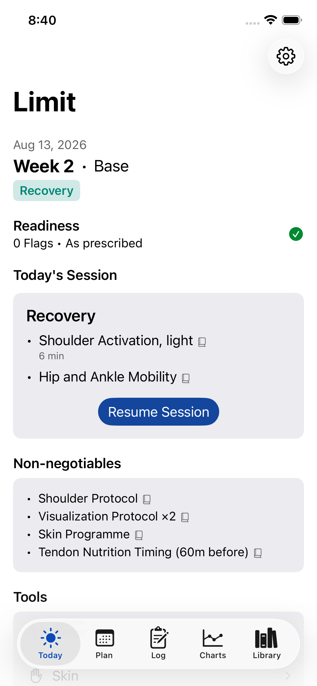
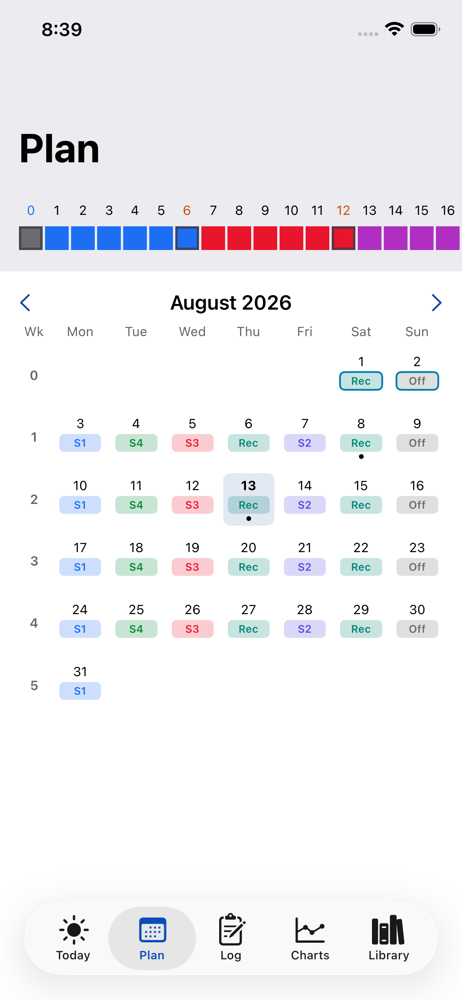
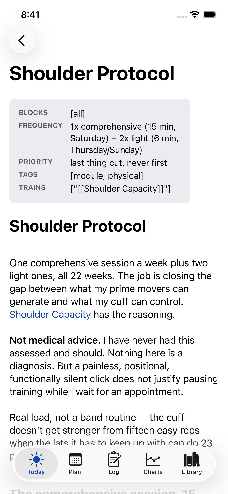
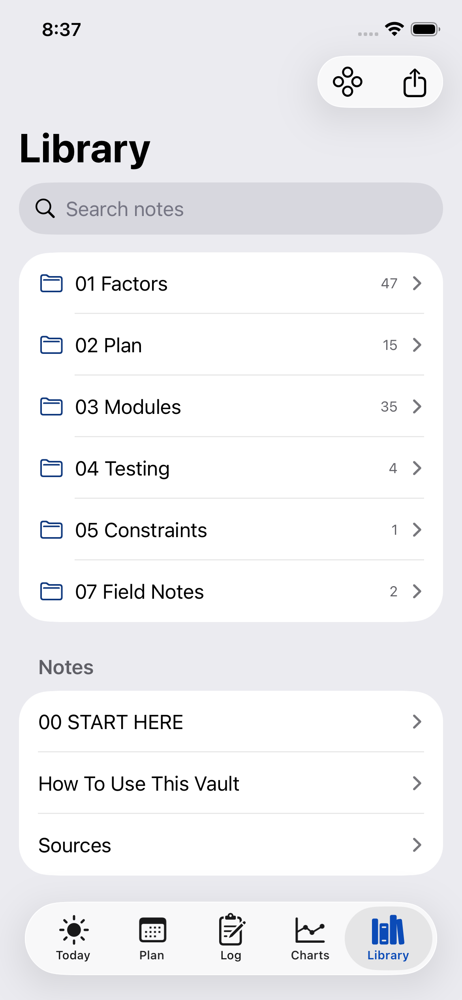

# Limit

Limit is an iOS training companion application for climbing and physical conditioning. The app tracks climbing-specific physical metrics, parses structured training plans, and reads physiological data to calculate daily session readiness. 

<table>
<tr>
<td width="25%"></td>
<td width="25%"></td>
<td width="25%"></td>
<td width="25%"></td>
</tr>
<tr>
<td>Today</td>
<td>Plan calendar</td>
<td>Vault note, rendered</td>
<td>Library</td>
</tr>
</table>

The application uses HealthKit to read resting heart rate, heart rate variability, and sleep data. It compares this data against custom readiness rules. The core models track finger strength, pulling strength, and local environmental conditions like rock temperature versus dew point.

Features:
* Parses JSON seed data for training modules, sessions, and blocks.
* Reads HealthKit metrics to determine daily training readiness.
* Includes an iOS Widget for quick data access.

This repository contains the source code, tests, and widget implementation. The app uses SwiftData for local persistence. 

The project was originally built for a single user's specific training protocol. The design and logic apply equally to other climbers tracking similar strength and readiness metrics. 

## Development

Claude was used throughout this project for efficiency, implementing features and maintaining the codebase under direction and review. The training content is a separate matter: every module dose, progression, and stop rule in the vault is sourced from published research and coaching literature, cited inline in the notes themselves, and has been checked for accuracy rather than generated wholesale.

## Technical details

The iOS deployment target is 17.0. The Xcode project configuration is managed via XcodeGen and project.yml. HealthKit access is restricted to read-only for specific sample types during the morning survey. The app requires no external servers or background delivery entitlements.
