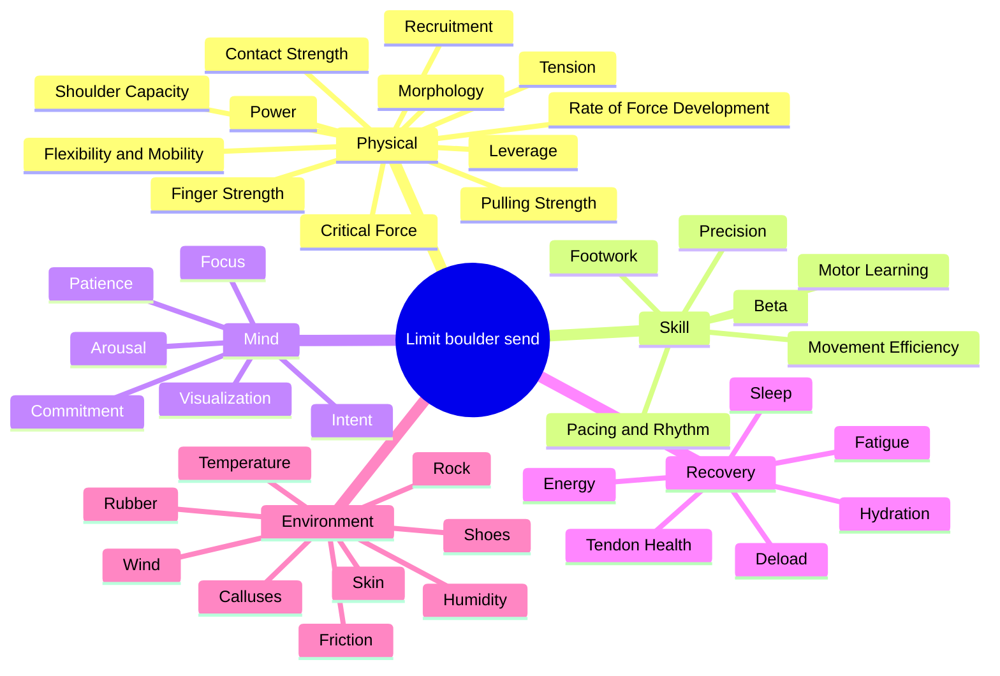

# Limit Boulder Vault

A limit boulder is one I can't currently do. Sending it means closing a gap, and the gap is never one thing. Finger force at a specific joint angle, on a specific hold, at a specific skin moisture, in a body position I haven't found yet, on a day my nervous system cooperates.

This vault splits that into factors, attaches a module to each factor that has one, and stacks the modules into 22 weeks.

## Entry points

- [[Factors MOC]] — what determines whether it goes. The problem.
- [[Modules MOC]] — 30 trainable units. What I do on Tuesday.
- [[Plan MOC]] — the 22 weeks that sequence them.
- [[Testing MOC]] — the numbers that say whether it worked.

Plus:

- [[Constraints MOC]] — my shoulder, my shins, my skin. These override the plan.
- [[Sources]] — every study behind the claims, graded, with the weak ones marked.

## Map

## Wiring

Factor notes: what it is, how much it explains, whether it's trainable, which module trains it. Module notes: dose, progression rule, stop rule. Plan notes assemble modules into weeks. Nothing orphaned — if a factor has no module, the note says why.

Graph view: factors cluster by domain, modules radiate from factors, the plan pulls from both. A node with no edges means I've broken something.

## Things I'll want to argue with

Evidence quality varies wildly. Lattice's regression on 901 climbers is data. "This rubber edges better" is a shore-hardness number plus vibes. Each note flags which.

Some of my favourite training ideas don't survive the data. Power endurance predicts nothing about my best boulder ([[Critical Force]]). Ape index predicts nothing about anything ([[Morphology]]). Caffeine at 3 mg/kg didn't improve grip or pull in climbers, only the feeling of it ([[Energy]]).

The plan has reduced weeks. I wanted none. Reduced weeks aren't stops, they're the mechanism that makes the hard weeks work — skip them and weeks 14-22 come out worse than weeks 8-13. See [[Deload]].

[[Checkpoints]] tells me whether it's working at weeks 5, 6, 11, 12, 18, 19 and 22, and separates "working but feels bad" from "not working." Weeks 7-11 will feel bad. Read it before I get there.

Conventions in [[How To Use This Vault]]. Start at [[Block 0 — Baseline Week]].

Tooling: App Build Prompt is the spec for an iOS companion app that runs this plan.
